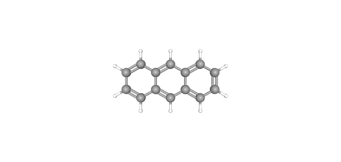
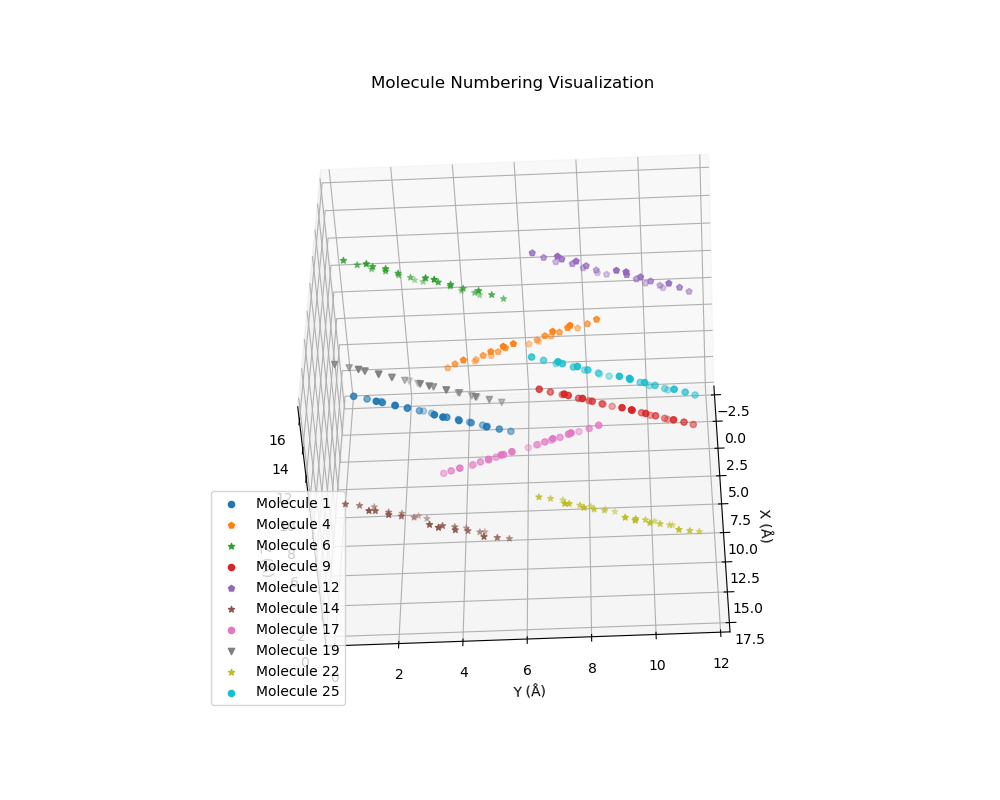

# Example of elph to work: Anthracene

In this file, we will use Anthracene (one of the simple structure in molecular semiconductors) as an example.

## Setting environment for elph.py and visual.py

We recommend using conda to create virtual environment.

```
    conda create -n elph
```


For installing Catnip (ChArge TraNsfer Integral Package), please refer to https://joshuasbrown.github.io/docs/CATNIP/catnip_downloads.html

## The chemical structure of Anthracene




## Tutorial

1. Upload anthracene.cif, phonopy_disp.yaml from Phonopy, and FORCE_CETS from Phonopy.

2. Identify 3 nearest neighbors in Anthracene crystal, as shown in the figure below. Run visual.py to get the numbering of 3 monomers. As the figure shown, we select monomer 17 (pink circle), 19 (grey triangle) and 25 (blue circle) for the input.



3. 

```
elph -m 17 19 25 
```

## First stage: Unwrap crystal structure and create 3 monomers and 3 dimers and calculate charge transfer integral $J_{0}$.

1. After submitting the script, it will create 6 folders (1/; 2/; 3/; A/; B/; C/). Folder 1, 2, and 3 are monomers folders and Folder A, B and C are dimers folders.

2. Each folder contains an .xyz file, mo.com, mo.log, and 1.pun files when the script finishes GAUSSIAN simulation. This step is to get .pun (molecular orbital file) .log (Output from GAUSSIAN) for the following simulation.

3. Run Catnip to get $J_{0}$

```
folder/
    ├── 1/
    |   └── monomer_1.xyz; 1.pun; mo.com; mo.log
    ├── 2/
    |   └── monomer_2.xyz; 2.pun; mo.com; mo.log  
    ├── 3/
    |   └── monomer_3.xyz; 3.pun; mo.com; mo.log 
    ├── A/
    |   └── dimer_A.xyz; A.pun; mo.com; mo.log
    ├── B/
    |   └── dimer_B.xyz; B.pun; mo.com; mo.log
    ├── C/
        └── dimer_C.xyz; C.pun; mo.com; mo.log

```

| Dimers | Transfer Integral $J_{0}$ (eV) | Effective Transfer Integral $J_{0, eff}$ (eV) | 
|----------|----------|----------|
|   A  |  -0.0325888   |   -0.0205049  | 
|   B  |  -0.0325888   |   -0.0205049  | 
|   C  |  -0.0576733   |   -0.0402473  | 

## Second stage: Create displaced structures and calculate charge transfer integral $J_{ij}$.

1. In each monomer folder and dimer folder, the script will create "displacements" folder and create displaced structures in the folder. The number of the structures will be 6N, where N is the number of atoms of the monomer or dimer.

2. The script will loop through every folder to run GAUSSIAN and return .pun and .log files.

3. Run Catnip to get transfer integral $J_{ij}$, where i and j are the numbering of monomers.

Explaination:

(1) na: the numbering of the atom

(2) vec: 1,2 and 3, refers to (x,y,z) direction

(3) sign: +1 and -1
```
folder/
├── 1/
|   └── displacements/; monomer_1.xyz; 1.pun; mo.com; mo.log
|        └── disp_{na+offset}_{vec}_{sign}/
|        |     └── mo.com; mo.logl disp_{na+offset}_{vec}_{sign}.xyz; disp_{na+offset}_{vec}_{sign}.pun
.        . 
.        .
.        .
```

## Third stage: Run Phonopy Modulation to create crystal structures with displacements and calculate electron phonon coupling parameter g.

Phonopy modulation is used to create a crystal structure with displacements along normal modes at q-point in the specified supercell dimension. We use FORCE_SETS file from Phonopy simulation (Finite Displacement Method) to get mesh.yaml, which contains Phonon mode information. In 8x8x8 q-points, there are 128 exclusive q-points and 18432 phonon modes (frequency).

At the end, we will get "ep_coupling.npz" file as the output we want.